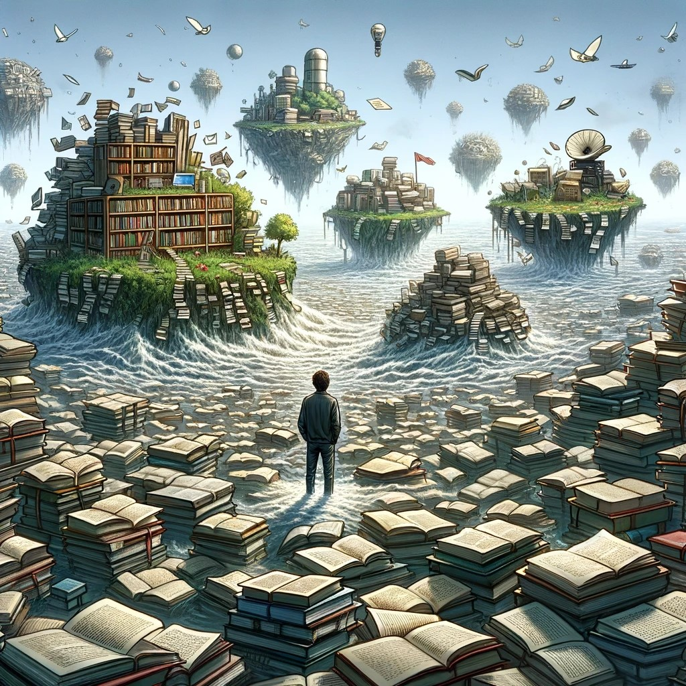

Mostly every post should try to answer few questions/conflicts of mine, so that I can have an image of my views on a topic on time axis. I can later review, on how it has evolved over the time.

I was initially attracted to gaining knowledge. And to be honest, it was in the expectations that I can leverage this additional knowledge to get something in return like a job.  It was also in the process of seeking some security and stability in life in the hope that this additional knowledge will give us an edge for acquiring them. But, from my experience, it didnt help me at all. In the contrary, it made me more insecure to the point that you feel that it has become a curse. 

If we take few steps back, the only purpose of accumulating knowledge is to build an internal model of a system, so that it can help us to take optimal action given a set of conditions. The most important thing is here to take an action. Only action can validate the utility of our knowledge. Most often, we lose sight of this and indulge in continuous and deep exploration of all the various types of spaces that can exist around a field and we see few experts publishing all the complex papers with funky techniques, which have near zero utility in the real world. While it gives us an illusion that we are doing something, in terms of utility for the world, it means nothing. Furthermore, the pursuit of over optimization of knowledge can trap us in the myriads of local minima and it will be very difficult to come out of those trenches as we mostly become blind to any other type of knowledge offferings from the external world. And we will never feel satisfied as we did nothing useful with that knowledge in the real world. It kind of reminds me of Faust's pursuit of knowledge in the German play writtent by Goethe (Goethe, as an adminsitrator and writer did a lot in real life though). Replace knowledge with money and its more likely that we end up with the same result.

*A person waist-deep in an endless sea of books, scrolls, and papers, overwhelmed by knowledge. Image generated by OpenAI's DALL·E, a text-to-image AI model, on [2024-02-24].*

*A person waist-deep in an endless sea of books, scrolls, and papers, overwhelmed by knowledge. Image generated by OpenAI's DALL·E, a text-to-image AI model, on [2024-02-24].*

*Image: "Dr. Fausto" by Jean Paul Laurens. Source: [Wikipedia](https://en.wikipedia.org/wiki/Faust#/media/File:Jean_Paul_Laurens_-_Dr._Fausto.jpg). Licensed under Public Domain.*

Then whats the other way round. I guess its better to have basic fundamentals right and open to different possibilities in the world, so that given a case where you strongly feel about a problem, you build from your basics, then go to any extent  of collecting knowledge without any timidness to solve the issue at hand. This I feel the most useful framework to have, it will open you to worldly possibilities and brings a bit about lividity in life. Otherwise, overtime we develope an attitude where you inclined to secure a certainty first instead of having a bias to action, forgetting that its the action that digs out knowledge and help us to have a better realistic model of the issue.